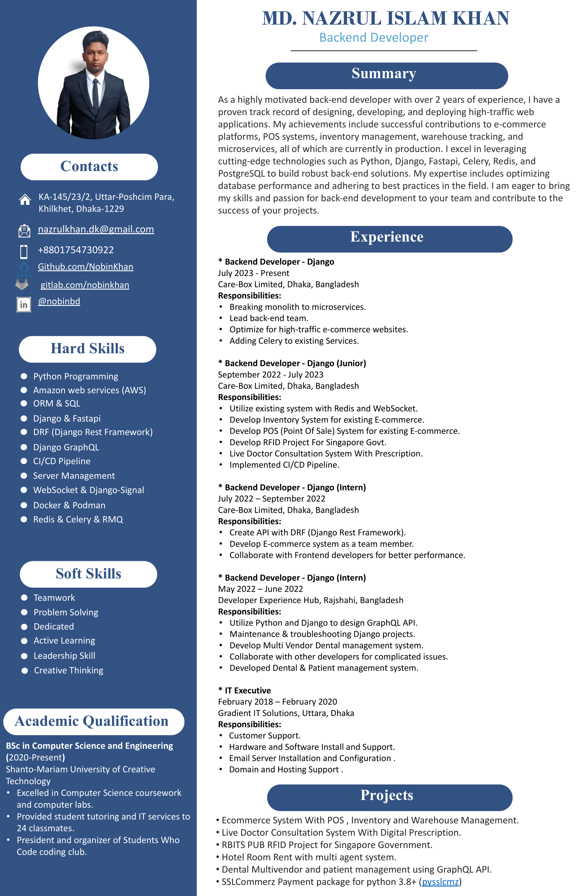

# VTS Interview Project

## Project Info

- Programming Lanuage: `Python`
- Web Framework: [`Fastapi`](https://fastapi.tiangolo.com/)
- ORM: [`Piccolo ORM`](https://github.com/piccolo-orm/piccolo) (Not Recommended)
- Database: `Postgresql`
- Database Management Tool: `Pgadmin4`
- Container Runner: `Docker`
- CI/CD: `Github Action`
- Testing: `Auto via ci/cd`

#### N.B:
I'm a Django developer with experience in various projects, including e-commerce, inventory management, POS systems, and asset tracking systems, all of which are successfully running in production at my current company. To expand my skillset, I decided to take on a new challenge by learning FastAPI by doing this wonderfull project.


## Setup Instructions
### Requirements
```text
1. Docker (version 26 or up)
2. Python (version 12.2)
3. Poetry (Python package manager, similer to pip.)
```
### Instruction to run locally (Linux Terminal or mac terminal or windows wsl)
```bash
# Clone this project
git clone https://github.com/NobinKhan/vts_interview.git

# open project directory
cd vts_interview

# Install project dependency
poetry install

# Create a .env file and copy the contents of .env.sample
cp .env.sample .env # change values according to your database

# Setup orm env config
export PICCOLO_CONF=sub_module.piccolo_conf

# Migrate database
piccolo migrations forward all

# Load Dummy data (data from question)
piccolo app.auth load_data && piccolo app.movie load_data

# Now run this project with granian on port 8000
granian --interface asgi conf.server:app --host 0.0.0.0 --port 8000

# Open web browser and go to http://127.0.0.1:8000/

```
### Instruction to run locally (with docker)
```bash
# Clone this project
git clone https://github.com/NobinKhan/vts_interview.git

# open project directory
cd vts_interview

# Build Image and run
docker compose up -d # it will took some time to build

# After finish docker run open web browser and go to http://127.0.0.1:8000/

```
- For api docs http://127.0.0.1:8000/docs/
- For login info as user, use provided dummy data.
- Or to create user, use create user api.
- Pgadmin also included in docker compose file
- To access pgadmin http://127.0.0.1:5050/
- Pgadmin credentials in .env.sample file


### My Assumptions
I have made many assumpsions but it will be easy for me if we disscuss it later.

### How Much Problem I Solved?
 apologize that the task is coming in a bit later than expected due to my current workload at my job. However, I'm happy to report that I've been able to complete the task to the best of my ability. Let me know if you'd like me to walk you through my approach.

### [My CV](NazrulIslam.pdf)

